# 🛒 Flutter E-Commerce Demo App

A demo e-commerce mobile application built with **Flutter**, focused on clean UI, Firebase integration, and real-world app architecture.

This project is created for learning, practice, and portfolio purposes, showcasing modern Flutter development concepts.

---

## 🔐 Authentication & User Onboarding

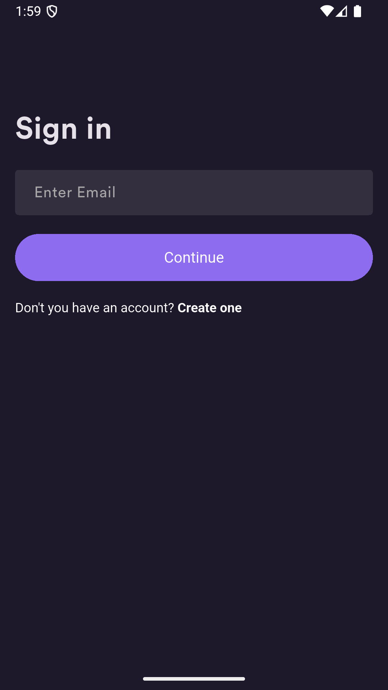 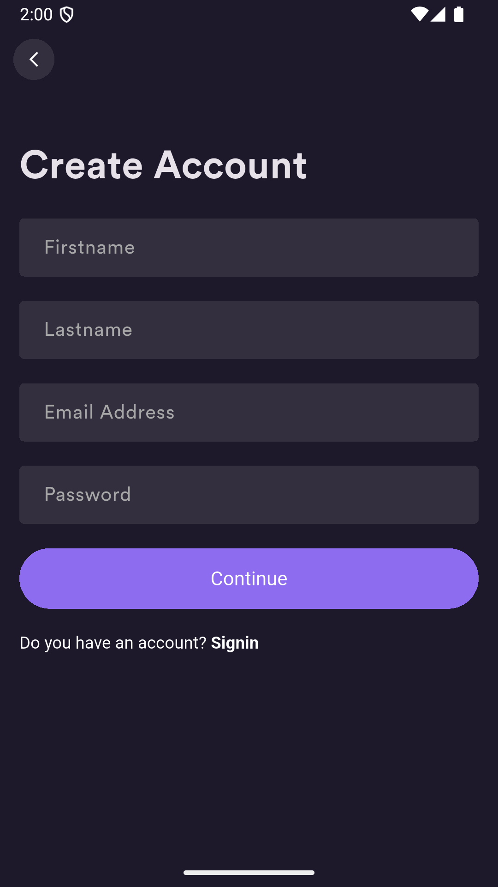 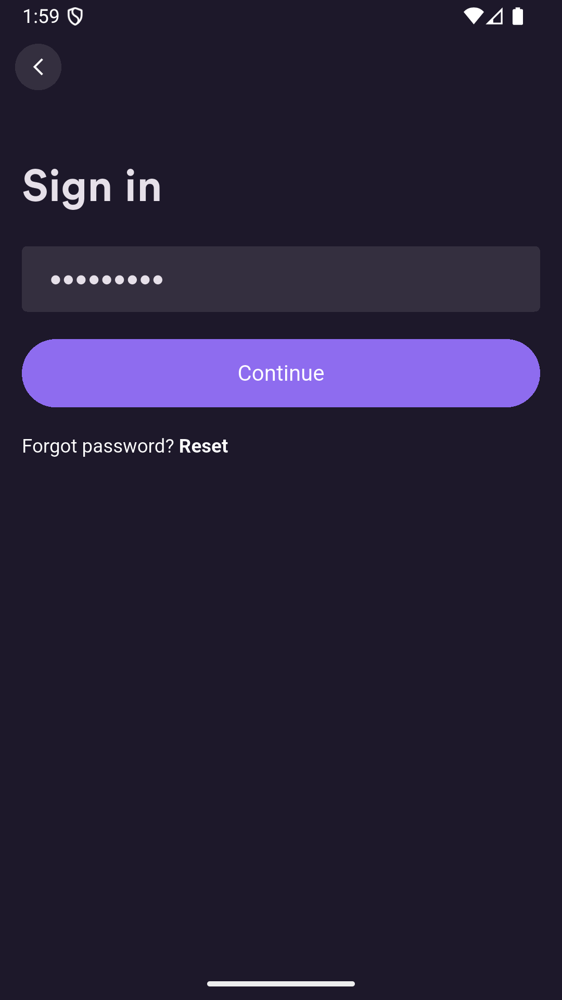 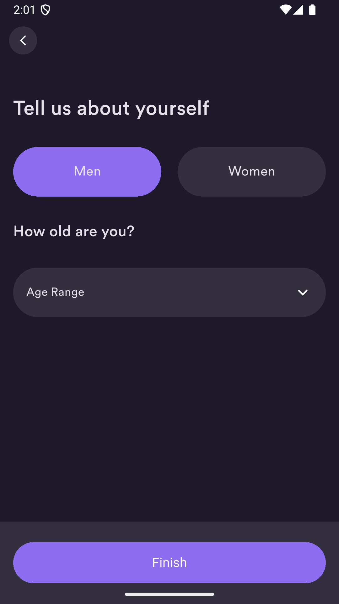

**Features:**
- Firebase Authentication (Sign In / Sign Up)
- User onboarding flow
- Secure authentication handling
- Clean and simple UI design

---

## 🛍 Product Browsing & Favorites

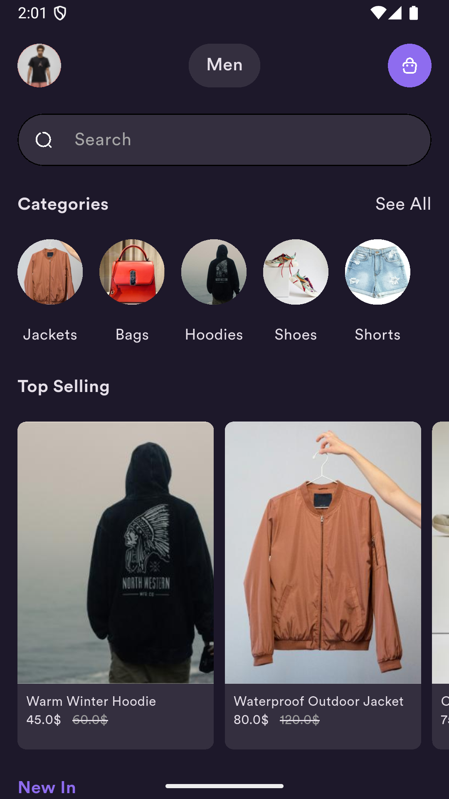 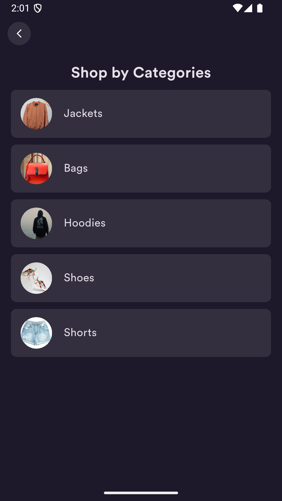 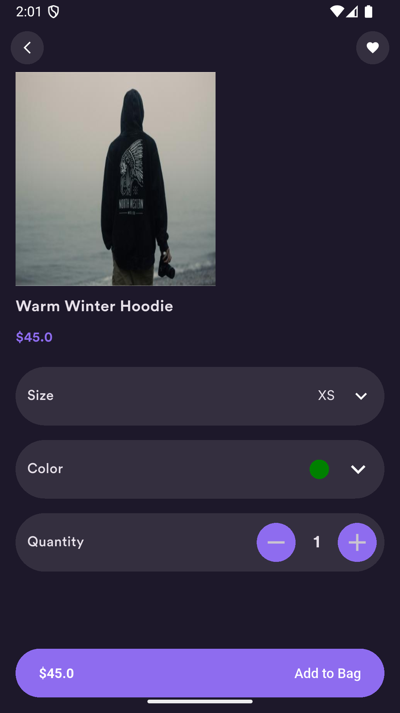 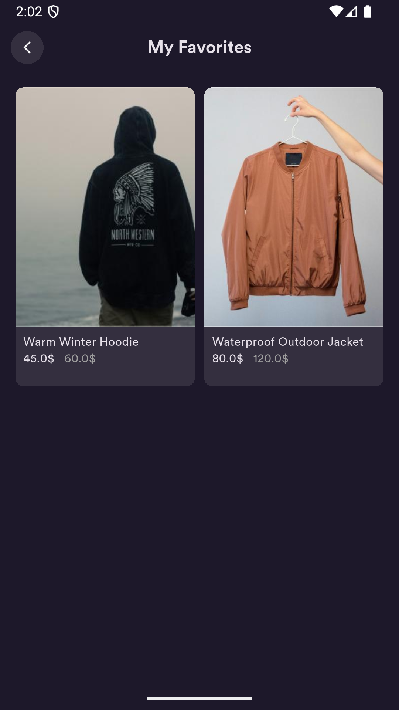

**Features:**
- Product listing from Firestore
- Category-based browsing
- Product detail pages
- Favorites functionality
- Responsive UI layout

---

## 🛒 Cart, Orders & Settings

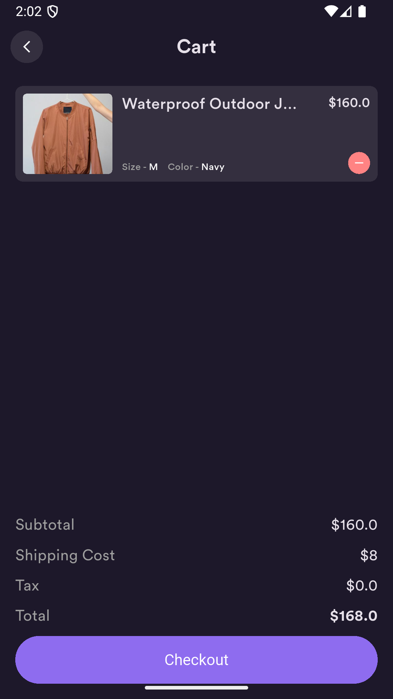 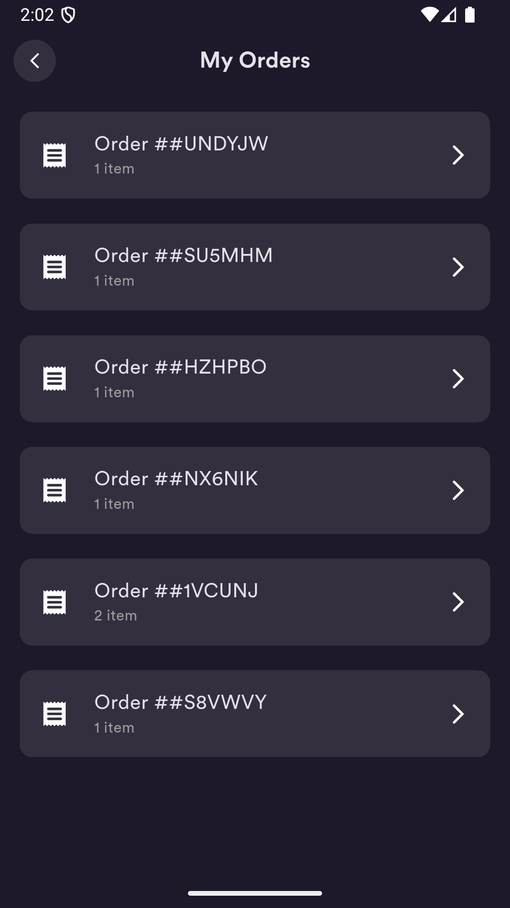  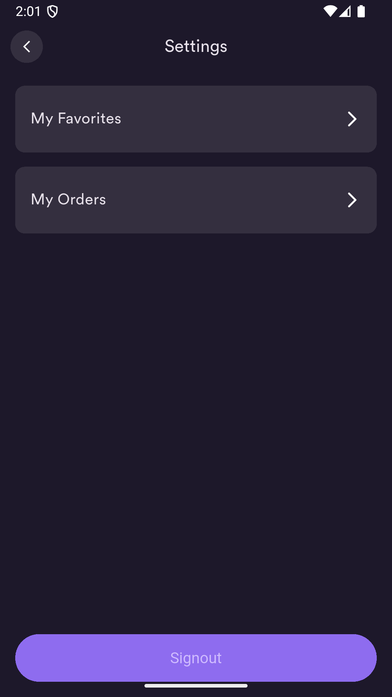

**Features:**
- Cart (bag) management
- Order creation and order history
- Order completion flow
- User settings screen
- Firestore & Firebase Storage integration

---

## 🧰 Tech Stack

- Flutter & Dart  
- Firebase Authentication  
- Cloud Firestore  
- Firebase Storage  
- State Management (Cubit / Bloc)  
- Responsive UI Design  

---

## 📦 Flutter Packages Used

This project uses the following Flutter & Dart packages to implement core features and maintain clean architecture:

### 🔐 Authentication & Backend
- **firebase_core** – Firebase initialization and core services  
- **firebase_auth** – User authentication (Sign In / Sign Up)  
- **cloud_firestore** – NoSQL database for products, users, and orders  
- **firebase_storage** – Storing and serving product images  

### 🧠 State Management & Architecture
- **flutter_bloc** – State management using Cubit / Bloc pattern  
- **dartz** – Functional programming utilities (Either, Option)  
- **get_it** – Dependency injection and service locator  

### 🎨 UI & UX
- **flutter_svg** – Rendering SVG assets  
- **flutter_screenutil** – Responsive UI and adaptive layouts  
- **cupertino_icons** – iOS-style icons  

### 🧪 Utilities & Helpers
- **email_validator** – Email validation for authentication forms  
- **logger** – Debug logging during development  

### 🛠 Development Tools
- **flutter_launcher_icons** – App icon generation  
- **flutter_lints** – Recommended lint rules for clean code  

---

## 🧩 Architecture Overview

The project follows a **feature-based and scalable architecture**:
- **Presentation Layer** – UI & Cubit / Bloc state management  
- **Domain Layer** – Business logic and use cases  
- **Data Layer** – Firebase services (Auth, Firestore, Storage)  
- **Dependency Injection** – Managed with GetIt  

This structure helps keep the codebase clean, testable, and easy to extend.

---

## 🎯 Project Purpose

This application is a **demo project** built to practice and demonstrate:
- Real-world Flutter app structure
- Firebase backend integration
- Clean and maintainable UI
- Common e-commerce flows

---

## 📌 Notes

- This is **not a production application**
- Payment systems are not implemented
- Firebase configuration files are excluded for security reasons
- Built purely for learning and portfolio showcase

---

## 👨‍💻 Developer

Developed by **Süleyman Harbelioglu**  
Flutter Developer

🔗 GitHub Profile:  
https://github.com/suleymanharbelioglu
